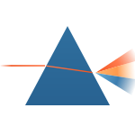

# Prism



Prism is Almasix's view engine — a **templating system for Python** with
layouts, components, slots, and directives, compiled ahead of time for a thin
render path.

Templates use the **`.prism.html`** extension and live under `resources/views`.

```python title="app/http/controllers/welcome_controller.py"
from almasix.prism import view

return view("welcome", {"name": "Ada"})
```

```html title="resources/views/welcome.prism.html"
@extends("layouts.app")

@section("content")
  <h1>Hello, {{ name }}</h1>
@endsection
```

:::tip[Full surface]
Prism covers the app-facing template surface — inheritance, control flow,
components & slots, stacks, localization directives, and custom `@directive`s —
not a minimal subset. This section grows as each surface ships.
:::

## In this section

- [Rendering Views](/prism/rendering/) — `view()`, data, escaping
- [Layouts & Inheritance](/prism/layouts/) — `@extends`, `@section`, `@yield`
- [Components & Slots](/prism/components/) — `<x-*>`, `@slot`, attributes
- [Control Structures](/prism/control/) — `@if`, `@foreach`, `@python`
- [Including Subviews](/prism/includes/) — `@include` and friends
- [Stacks & Directives](/prism/stacks/) — `@push`, `@stack`, custom directives
